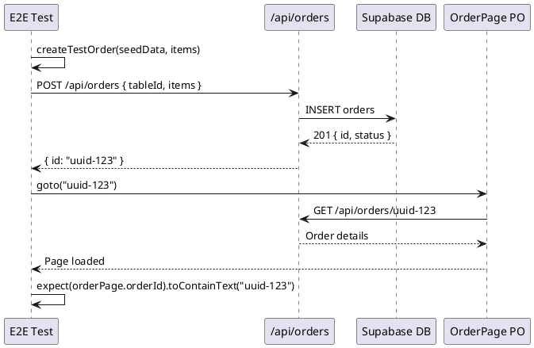
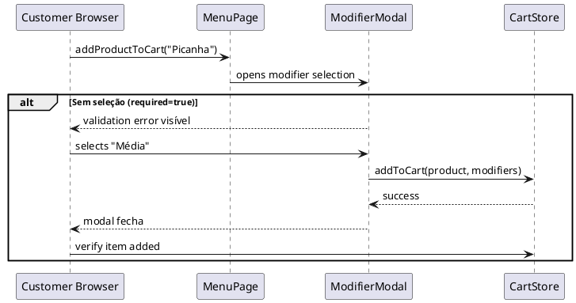
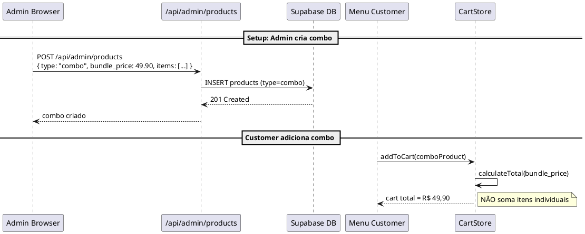
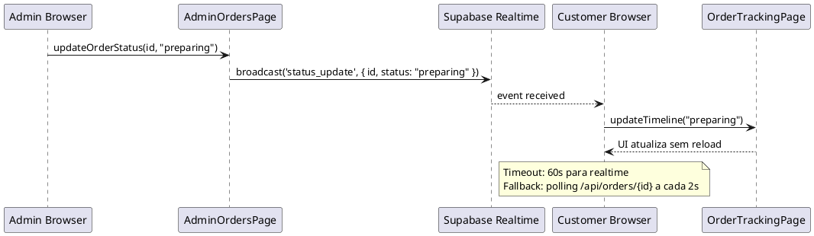

# Design: Melhoria de Testes E2E — Cobertura e Confiabilidade

## Change

- **Change Name**: 2026-04-24-melhoria-e2e
- **Project**: pedi-ai
- **Mode**: openspec

## Technical Approach

Esta mudança visa transformar 60% dos testes E2E que usam dados mockados em testes end-to-end com dados reais. A abordagem segue 3 fases:

1. **Fase 1 (Quick Wins)**: Substituir IDs hardcoded (`test-order-123`) por criação real via API
2. **Fase 2 (Fluxos Completos)**: Adicionar testes de modifier groups, combos, e realtime
3. **Fase 3 (Consolidação)**: Assertions fortes e documentação de coverage

---

## Architecture Decisions

### Decision: Real Order Creation via API

**Choice**: Criar pedidos reais via `POST /api/orders` ao invés de usar IDs mockados.

**Alternatives considered**:
- Manter IDs mockados e adicionar validação de existência no banco
- Criar orders via UI completa (menu → add to cart → checkout)

**Rationale**: A opção de API é mais rápida e confiável que flow UI completo, mas ainda testa o sistema real. UI flow completo será coberto pelos testes de checkout existentes.

---

### Decision: Realtime Updates via Supabase Channel Subscription

**Choice**: Usar `page.waitForFunction()` com polling e Supabase Realtime channel events.

**Alternatives considered**:
- `waitForChannel()` do @supabase/supabase-js
- Polling contínuo com `setInterval`

**Rationale**: Supabase Realtime é o padrão do projeto. Playwright não tem built-in para canais, então `waitForFunction` com `channel.subscribe()` é a solução mais limpa. Polling fallback garante resiliência em CI.

---

### Decision: Modifier Group Testing via Seed Data

**Choice**: Adicionar produtos com modifier groups obrigatórios e opcionais no seed.

**Alternatives considered**:
- Criar produtos via API em `beforeAll` de cada test
- Mockar modifier groups no client

**Rationale**: Seed é executado uma vez por sessão de teste, enquanto `beforeAll` com API criaria dados redundantes em cada test file. Dados de seed pré-validam o schema do banco.

---

### Decision: Combo Bundle Price Testing

**Choice**: Admin cria combo via API em `beforeAll`, cliente adiciona via UI.

**Alternatives considered**:
- Criar combo inteiramente via UI no admin
- Mockar dados de combo no frontend

**Rationale**: Criar via API é mais rápido e determinístico. Teste de UI admin para combo creation será coberto pelos testes de admin/products existentes.

---

### Decision: Page Objects com Return Types para Assertions

**Choice**: Métodos de Page Object que retornam contagens/valores para assertions diretas nos tests.

**Alternatives considered**:
- Assertions dentro do Page Object
- Métodos void com waitForResponse interno

**Rationale**: Separação de responsabilidades: Page Objects encapsulam locators, tests fazem assertions. Isso facilita reuso e debug.

---

### Decision: Soft Assertions para Filter/Search Tests

**Choice**: Usar `softExpect` do `soft-assertions.ts` para coletar todas falhas de filter/search.

**Alternatives considered**:
- Assertions hard (fail fast)
- Sem verificações adicionais

**Rationale**: Filter tests precisam verificar TODOS os resultados, não apenas o primeiro. Soft assertions permitem coletar todos os erros antes de falhar.

---

## Data Flow

### Fluxo: Real Order E2E

```
Teste E2E
    │
    ▼
createTestOrder() ──► POST /api/orders
    │                    │
    │                    ▼
    │               201 Created
    │                    │
    │                    ▼
    │               { id: "uuid-123", ... }
    │                    │
    ▼                    │
OrderPage.goto(uuid)     │
    │                    ▼
    │               Redireciona para /order/uuid-123
    │                    │
    ▼                    ▼
Assertions ◄────────── Order Details carregados
```

### Fluxo: Modifier Groups E2E

```
Seed: produto "Combo BBQ" com modifier group "Tamaño" (required=true)
    │
    ▼
MenuPage.addProductToCart("Combo BBQ")
    │
    ▼
ModifierModal abre (modal ou inline panel)
    │
    ├── Caso 1: Sem seleção → validation error visível
    │                │
    │                ▼
    │           Cart NÃO atualizado
    │
    └── Caso 2: Seleciona "Grande" → add to cart funciona
                     │
                     ▼
                Cart atualiza com modifier
```

### Fluxo: Combo Bundle Price

```
Admin (beforeAll): POST /api/admin/products com type="combo"
    │
    ▼
Combo criado com bundle_price < sum(itens)
    │
    ▼
Cliente adiciona combo ao carrinho
    │
    ▼
Cart total = bundle_price (NÃO soma dos itens)
    │
    ▼
Checkout: total reflete bundle price correto
```

### Fluxo: Realtime Updates

```
┌─────────────┐                      ┌──────────────────┐
│  Admin UI   │                      │  Customer UI     │
│  (browser)  │                      │  (browser)       │
└──────┬──────┘                      └────────┬─────────┘
       │                                        │
       │  click "preparando"                    │ channel.subscribe()
       │                                        │   ('order-updates')
       ▼                                        │
  updateOrderStatus()                           │
       │                                        │
       ▼                                        │
  Supabase ──────────────────────────────────► broadcast
  Realtime                                      │
  Channel                                       │
       │                                        ▼
       │                                 waitForFunction()
       │                                        │
       ▼                                        ▼
  Order list              ──►              Timeline atualiza
  atualiza                                    sem reload
```

---

## File Changes

### Novos Arquivos

| Arquivo | Propósito |
|---------|-----------|
| `tests/e2e/tests/shared/helpers/orderUtils.ts` | Helper para criação de pedido real via API |
| `tests/e2e/tests/shared/fixtures/realOrder.fixture.ts` | Fixture que cria order real e provê ID |
| `tests/e2e/tests/customer/modifier-groups.spec.ts` | Testes de modifier mandatory/optional |
| `tests/e2e/tests/customer/combos.spec.ts` | Testes de combo com bundle price |
| `tests/e2e/tests/admin/combos-admin.spec.ts` | Testes de criação de combo pelo admin |
| `tests/e2e/tests/admin/realtime-updates.spec.ts` | Testes de realtime order status |

### Arquivos Modificados

| Arquivo | Mudanças |
|---------|----------|
| `tests/e2e/scripts/seed.ts` | Adicionar: produtos com modifier groups (obrigatório/opcional), produtos tipo combo |
| `tests/e2e/tests/customer/order.spec.ts` | Substituir `test-order-123` por `createTestOrder()`, adicionar assertions de contagem |
| `tests/e2e/tests/customer/payment.spec.ts` | Substituir mock por PIX order real, adicionar webhook validation |
| `tests/e2e/tests/admin/orders.spec.ts` | Remover conditional assertions (`if (count > 0)`), adicionar contagens |
| `tests/e2e/tests/admin/products.spec.ts` | Completar locator `product-description-input`, assertions de filter |
| `tests/e2e/tests/admin/categories.spec.ts` | Completar locator `category-description-input` |
| `tests/e2e/pages/AdminOrdersPage.ts` | Adicionar: `getError()`, `filterByStatus()` com retorno de count, `searchByCustomerEmail()` com count |
| `tests/e2e/pages/AdminProductsPage.ts` | `searchProducts()` e `filterByCategory()` retornam count para assertions |
| `tests/e2e/pages/AdminCategoriesPage.ts` | Já possui `categoryDescriptionInput` — OK |
| `tests/e2e/pages/OrderPage.ts` | Adicionar locator para timeline de status realtime |
| `tests/e2e/tests/shared/fixtures/index.ts` | Adicionar `orderUtils` helper para criação de pedido real |
| `tests/e2e/README.md` | Atualizar matriz de coverage |

### Arquivos Removidos/Nomeados

| Arquivo | Ação |
|---------|------|
| `tests/e2e/tests/customer/order.mock.spec.ts` | Renomear do antigo `order.spec.ts` se existir backup |

---

## Interfaces / Contracts

### Nova Interface: OrderCreationResult

```typescript
interface OrderCreationResult {
  id: string           // UUID do pedido criado
  status: OrderStatus  // Status inicial (ex: 'pending_payment')
  total: number        // Total calculado
  items: Array<{
    productId: string
    name: string
    quantity: number
    modifiers?: ModifierSelection[]
  }>
}
```

### Extended SeedData Interface

```typescript
interface SeedData {
  // ...existing fields...
  products: Array<{
    id: string
    name: string
    price: number
    category_id: string
    modifierGroups?: ModifierGroup[]  // NOVO
    comboItems?: ComboItem[]          // NOVO
  }>
}
```

### Page Object Method Contracts

```typescript
// AdminOrdersPage
async filterByStatus(status: AdminOrderStatus): Promise<number>  // retorna count
async searchByCustomerEmail(email: string): Promise<number>        // retorna count
async getError(): Promise<string>                                 // retorna mensagem

// AdminProductsPage  
async searchProducts(query: string): Promise<number>              // retorna count
async filterByCategory(categoryName: string): Promise<number>      // retorna count

// OrderPage
async waitForRealtimeStatus(status: OrderStatus, timeout?: number): Promise<void>
async getStatusTimelineEntries(): Promise<TimelineEntry[]>
```

---

## Testing Strategy

### Estratégia de Dados

1. **Seed Isolation**: Cada test worker usa seu próprio restaurant ID único (UUID v4)
2. **Cleanup**: `beforeEach` limpa orders criadas no test anterior (soft delete por `is_test=true`)
3. **Idempotência**: Seed com prefixo `e2e+` para cleanup fácil

###标记 Strategy

- `@smoke`: Tests críticos (order creation, checkout, payment)
- `@slow`: Tests que aguardam webhooks ou realtime (120s+ timeout)
- Sem tag: Tests normais (< 30s)

### CI Sharding (4 workers)

| Shard | Tests |
|-------|-------|
| 1 | Auth, Menu, Cart |
| 2 | Checkout, Payment PIX |
| 3 | Admin Orders, Admin Products |
| 4 | Modifiers, Combos, Realtime |

### Polling Fallback para Realtime

```typescript
async waitForRealtimeStatus(status: string, timeout = 60_000): Promise<void> {
  const deadline = Date.now() + timeout
  
  // Tenta realtime primeiro
  const channel = supabase.channel(`order-${this.orderId}`)
  channel.on('broadcast', { event: 'status_update' }, (payload) => {
    if (payload.newStatus === status) {
      channel.unsubscribe()
    }
  })
  channel.subscribe()
  
  // Fallback: polling a cada 2s se realtime falhar
  while (Date.now() < deadline) {
    const currentStatus = await this.getStatus()
    if (currentStatus === status) return
    await this.page.waitForTimeout(2_000)
  }
  
  throw new Error(`Timeout esperando status: ${status}`)
}
```

---

## Migration / Rollout

### Fase 1: Quick Wins (1-2 dias)

1. Adicionar `orderUtils.ts` com `createTestOrder()`
2. Modificar `fixtures/index.ts` para exportar `createOrder` helper
3. Atualizar `order.spec.ts` para usar IDs reais
4. Adicionar locator `categoryDescriptionInput` em `AdminCategoriesPage.ts`

### Fase 2: Fluxos Completos (3-4 dias)

1. Expandir `seed.ts` com modifier groups e combos
2. Criar `modifier-groups.spec.ts`
3. Criar `combos.spec.ts` e `combos-admin.spec.ts`
4. Implementar `waitForRealtimeStatus()` em `OrderPage.ts`
5. Criar `realtime-updates.spec.ts`

### Fase 3: Consolidação (2 dias)

1. Atualizar `AdminOrdersPage.ts` com métodos que retornam counts
2. Adicionar assertions em todos os filter/search tests
3. Atualizar `README.md` com matriz de coverage

### Rollback Plan

1. Manter specs antigas em `tests/e2e/tests/customer/order.mock.spec.ts`
2. Feature flag `E2E_SKIP_NEW_TESTS=true` para disable
3. Runner minimal `playwright.minimal.config.ts` continua rodando só auth.spec

---

## Open Questions

| Questão | Status | Resolução |
|---------|--------|-----------|
| PIX webhook timeout (120s) afeta CI? | **RESOLVIDO** | Usar mock webhook simulation via `page.evaluate()` para disparar confirmação PIX sem Mercado Pago real |
| Modifier modal é global ou por produto? | **RESOLVIDO** | Modifier selection acontece na ProductDetail page via modal component |
| Combo products têm schema diferente no banco? | **RESOLVIDO** | Usar tabelas `combo`/`combo_items` existentes no Supabase — nenhum schema novo necessário |
| Realtime channel nomeado ou por order ID? | **RESOLVIDO** | Channel name `orders-{restaurantId}` com postgres_changes filter |

---

## Sequence Diagrams

### Sequence: Real Order Creation



### Sequence: Modifier Mandatory Selection



### Sequence: Combo Bundle Price



### Sequence: Realtime Order Update


